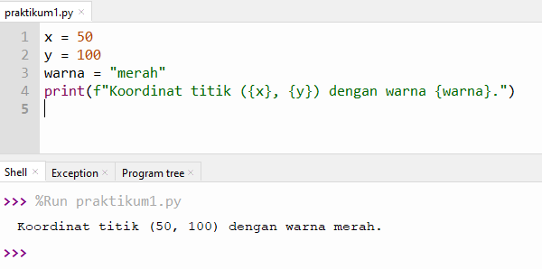

<h1 align="center">
LAPORAN PRAKTIKUM PADA PERTEMUAN 2
</h1>

## 1. PRAKTIKUM 1

KODE PROGRAM :

    x = 100
    y = 50
    warna='red'
    print(f"Koordinat titik ({x}, {y}) dengan warna {warna}.")

HASIL OUTPUT :

PENJELASAN :

Pada file <b><i>"praktikum1.py"</i></b> merupakan latihan dasar tentang variabel dan tipe data di Python.
Pada program ini terdapat tiga variabel, yaitu: x , y , warna. 
Python tidak memerlukan deklarasi tipe data secara eksplisit,
tipe data akan ditentukan secara otomatis berdasarkan nilai yang diberikan.
Program kemudian menampilkan hasil ke layar menggunakan fungsi print()

----------------------------------------------------------

## 2. PRAKTIKUM 2

KODE PROGRAM :

      X = int(input("Masukkan nilai x: "))
      y = int(input("Masukkan nilai y: "))
      warna = input("Masukkan warna titik: ")
      
      print(f"Titik berada di ({x}, {y}) dan berwarna {warna}.")

HASIL OUTPUT :

PENJELASAN :

Pada file <b><i>"praktikum2.py"</i></b> merupakan latihan user input, konversi tipe data, dan output dengan format string (f-string) di Python.
Pada program ini:
input() digunakan untuk menerima data dari pengguna melalui keyboard.
Fungsi int() mengubah nilai yang diinput menjadi bilangan bulat (integer).
Variabel x dan y menyimpan koordinat titik, sedangkan warna menyimpan warna titik dalam bentuk string.

----------------------------------------------------------

## 3. PRAKTIKUM 3

KODE PROGRAM :
      
      x = int(input("Masukkan nilai x: "))
      
      if x > 0:
        print("Titik di kanan layar.")
      elif x < 0:
        print("Titik di kiri layar.")
      else:
        print("Titik di tengah.")
        
      print("Menampilkan 5 titik:")
      for i in range(1, 6):
        print(f"Titik ke-{i}")

HASIL OUTPUT :

PENJELASAN :

Pada file <b><i>"praktikum3.py"</i></b> merupakan latihan untuk memahami Struktur Kontrol (Kondisi dan
Loop) dalam Python.
🔹 Bagian 1 – Struktur Kontrol Kondisi if, elif, dan else
Program meminta pengguna memasukkan nilai x.
Jika x > 0, program menampilkan pesan “Titik di kanan layar.”
Jika x < 0, maka akan ditampilkan “Titik di kiri layar.”
Jika x = 0, berarti titik berada “di tengah.”
Struktur ini menunjukkan bagaimana Python melakukan pengambilan keputusan berdasarkan kondisi tertentu.

🔹 Bagian 2 – Struktur Perulangan for
Setelah menentukan posisi titik, program menampilkan 5 titik dengan menggunakan perulangan:
Perintah range(1, 6) akan menghasilkan urutan angka dari 1 sampai 5, karena index dimulai dari 0

Program ini menggabungkan dua konsep penting dalam pemrograman Python:
Percabangan (if, elif, else) untuk menentukan posisi titik berdasarkan nilai x.
Perulangan (for) untuk menampilkan daftar titik secara berurutan.

----------------------------------------------------------

## 4. PRAKTIKUM 4

KODE PROGRAM :

      import math
      
      def hitung_jarak(x1, y1, x2, y2):
          jarak = math.sqrt((x2 - x1)**2 + (y2 - y1)**2)
          return jarak
          
      hasil = hitung_jarak(0, 0, 3, 4)
      print(f"Jarak antara dua titik: {hasil}")
    
HASIL OUTPUT :

PENJELASAN :

Pada file <b><i>"praktikum4.py"</i></b> merupakan latihan untuk memahami Fungsi (Function)
🔹 Bagian 1 – Import Modul math
berfungsi untuk memanggil modul matematika bawaan Python
🔹 Bagian 2 – Fungsi hitung_jarak()
Fungsi ini digunakan untuk menghitung jarak antara dua titik pada bidang koordinat menggunakan rumus jarak Euclidean
Rumus tersebut dihitung dengan fungsi math.sqrt() yang berarti akar kuadrat.
🔹 Bagian 3 – Pemanggilan Fungsi
Artinya, program menghitung jarak antara titik (0, 0) dan (3, 4).

Program ini menunjukkan cara:
Menggunakan fungsi sendiri untuk melakukan perhitungan tertentu.
Mengimpor dan memanfaatkan modul math untuk operasi matematika.
Mengimplementasikan rumus jarak Euclidean ke dalam kode Python.
Dengan ini, pengguna dapat menghitung jarak antara dua titik di bidang 2D secara otomatis dan akurat.

----------------------------------------------------------

## 5.  PRAKTIKUM 5

KODE PROGRAM :

      # ==========================
      # Praktikum: Struktur Data Titik
      # ==========================
      
      # a. List berisi tiga pasangan titik dan tampilkan dengan for
      titik_list = [(0, 0), (50, 50), (100, 0)]
      print("Daftar Titik dalam List:")
      for titik in titik_list:
        print(titik)
        
      print()  # baris kosong
      
      # b. Tuple berisi satu titik
      pusat = (0, 0)
      print(f"Titik pusat adalah: {pusat}")
      
      print()  # baris kosong
      # c. Dictionary berisi atribut titik
      titik_dict = {"x": 10, "y": 20, "warna": "biru"}
      print(f"Titik ({titik_dict['x']},{titik_dict['y']}) berwarna {titik_dict['warna']}.")
  
HASIL OUTPUT :

PENJELASAN :

Pada file <b><i>"praktikum5.py"</i></b> program ini mempelajari struktur data dasar Python seperti 
list, tuple, dan dictionary untuk merepresentasikan titik (x, y) dalam bidang koordinat.

🔹 Bagian (a) – List
titik_list berisi tiga pasangan titik (x, y).
Dengan perulangan for, setiap elemen ditampilkan satu per satu
Tipe data list digunakan karena memungkinkan penyimpanan banyak titik dan mudah dimodifikasi (misalnya menambah atau menghapus titik).
List ditulis menggunakan kurung siku

🔹 Bagian (b) – Tuple
pusat adalah sebuah tuple, berisi satu titik pusat koordinat (0, 0).
Tuple digunakan karena nilainya tetap (immutable) — titik pusat biasanya tidak berubah.
Tuple ditulis dengan kurung bulat

🔹 Bagian (c) – Dictionary
Dictionary menyimpan titik dengan atributatau pasangan kunci, yaitu koordinat x, y, dan warna.
Akses data dilakukan menggunakan key, misalnya titik_dict["x"] menghasilkan nilai 10.
Dicrionary ditulis dengan tanda kurung kurawal

----------------------------------------------------------

