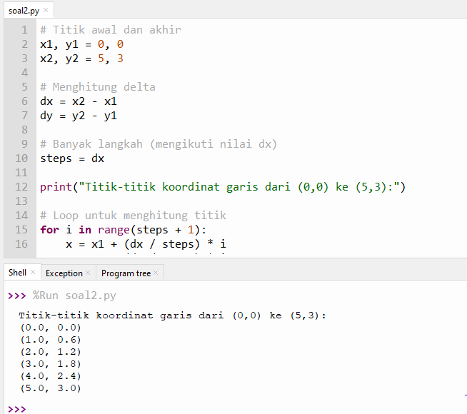

<h1 align="center">
LAPORAN PRAKTIKUM PADA PERTEMUAN 3
</h1>

## 1. PRAKTIKUM KOORDINAT SIMULASI KOORDINAT LAYAR

KODE PROGRAM :

    for y in range(0, 5):
      for x in range(0, 10):
        print(".", end="")
    print()

HASIL OUTPUT :

PENJELASAN :

Pada file <b><i>"simulasikoordinatlayar.py"</i></b> menampilkan grid (kotak) berukuran 5 baris × 10 kolom menggunakan karakter ".".
🔹 for y in range(0, 5):
→ Mengatur jumlah baris sebanyak 5.
Setiap iterasi y mewakili satu baris pada layar.

🔹 for x in range(0, 10):
→ Mengatur jumlah kolom sebanyak 10.
Setiap iterasi x mewakili satu kolom dalam satu baris.

🔹 print(".", end="")
→ Menampilkan simbol "." tanpa pindah ke baris baru (end="" mencegah baris berganti).
Hasilnya, sepuluh titik muncul secara horizontal dalam satu baris.

🔹print()
→ Digunakan untuk pindah ke baris berikutnya setelah satu baris selesai dicetak.

----------------------------------------------------------

## 2. PRAKTIKUM KOORDINAT SOAL 1

KODE PROGRAM :

    import math

    # Input titik
    x1 = float(input("Masukkan x1: "))
    y1 = float(input("Masukkan y1: "))
    x2 = float(input("Masukkan x2: "))
    y2 = float(input("Masukkan y2: "))

    # Hitung jarak Euclidean
    jarak = math.sqrt((x2 - x1)**2 + (y2 - y1)**2)

    # Menentukan kuadran titik pertama
    if x1 > 0 and y1 > 0:
        kuadran = "Kuadran I"
    elif x1 < 0 and y1 > 0:
        kuadran = "Kuadran II"
    elif x1 < 0 and y1 < 0:
        kuadran = "Kuadran III"
    elif x1 > 0 and y1 < 0:
        kuadran = "Kuadran IV"
    elif x1 == 0 and y1 == 0:
        kuadran = "Titik pusat (0,0)"
    elif x1 == 0:
        kuadran = "Berada pada sumbu Y"
    else:
        kuadran = "Berada pada sumbu X"

    # Output
    print("\n=== HASIL ===")
    print(f"Titik pertama: ({x1}, {y1})")
    print(f"Titik kedua  : ({x2}, {y2})")
    print(f"Jarak antar titik: {round(jarak, 2)}")
    print(f"Titik pertama berada di: {kuadran}")

HASIL OUTPUT :

PENJELASAN :

Pada file <b><i>"soal1.py"</i></b> menghitung jarak antara dua titik koordinat dan 
menentukan kuadran dari titik pertama berdasarkan sistem koordinat Kartesius (x, y).

🔹 Program meminta pengguna memasukkan dua titik:
    Titik pertama: (x1, y1)
    Titik kedua: (x2, y2)
    Semua nilai diubah menjadi float agar bisa menerima bilangan desimal
    
🔹 Perhitungan Jarak:Menggunakan rumus Euclidean

🔹Bagian  memeriksa posisi titik pertama:
  Kuadran I: x positif, y positif
  Kuadran II: x negatif, y positif
  Kuadran III: x negatif, y negatif
  Kuadran IV: x positif, y negatif
  Jika salah satu koordinat nol, berarti berada pada sumbu X atau Y.
    

----------------------------------------------------------

## 3.  PRAKTIKUM KOORDINAT SOAL 2

KODE PROGRAM :
      
    # Ukuran layar
    lebar = 10   # sumbu x (width)
    tinggi = 5   # sumbu y (height)

    # Titik yang akan ditampilkan
    x = 3
    y = 2

    # Menampilkan grid
    for row in range(tinggi):
        for col in range(lebar):
            if col == x and row == y:
                print("X", end=" ")
            else:
                print(".", end=" ")
        print()

HASIL OUTPUT :

PENJELASAN :

Pada file <b><i>"soal2.py"</i></b> mensimulasikan layar (grid) berukuran 10 kolom × 5 baris, 
di mana setiap piksel digambarkan menggunakan simbol ".".
Satu titik tertentu pada posisi (x = 3, y = 2) akan diganti menjadi simbol "X" untuk menandai posisi koordinat tersebut.

🔹 Penjelasan kode :
lebar = 10
→ Menentukan jumlah kolom (sumbu X) pada layar, yaitu 10 piksel secara horizonta
tinggi = 5
→ Menentukan jumlah baris (sumbu Y) pada layar, yaitu 5 piksel secara vertikal.
x = 3 dan y = 2
→ Menentukan koordinat titik yang akan ditandai.
Artinya titik "X" akan muncul pada kolom ke-3 dan baris ke-2.

🔹 Program ini menggunakan konsep koordinat raster, di mana layar komputer dianggap sebagai kumpulan titik (piksel) yang tersusun secara baris dan kolom.
Setiap titik memiliki posisi (x, y) tertentu, dan dapat diubah tampilannya sesuai kebutuhan.

----------------------------------------------------------

## 4. PRAKTIKUM REPRESENTASI GAMBAR SOAL 1

KODE PROGRAM :

      # Ukuran grid
    lebar = 10   # sumbu x
    tinggi = 10  # sumbu y

    # Titik yang akan diganti
    x = 4
    y = 6

    # Tampilkan grid
    for row in range(tinggi):
        for col in range(lebar):
            if col == x and row == y:
                print("X", end=" ")
            else:
                print(".", end=" ")
        print()
    
HASIL OUTPUT :

PENJELASAN :

Pada file <b><i>"PRAKTIKUMREPRESENTASIGAMBAR/soal1.py"</i></b> menampilkan grid berukuran 10×10 piksel (10 kolom dan 10 baris) menggunakan karakter ".",
kemudian mengganti satu piksel pada posisi (x=4, y=6) menjadi "X".
Tujuan praktikum ini adalah untuk memahami representasi gambar berbasis raster, 
di mana setiap titik pada layar komputer direpresentasikan sebagai piksel individual.

🔹lebar = 10
→ Menentukan jumlah kolom (sumbu X), yaitu lebar grid terdiri dari 10 piksel secara horizontal.
tinggi = 10
→ Menentukan jumlah baris (sumbu Y), yaitu tinggi grid terdiri dari 10 piksel secara vertikal.
x = 4 dan y = 6
→ Menentukan koordinat titik (kolom 4, baris 6) yang akan diganti menjadi simbol "X".
Semua titik lain tetap ".".

----------------------------------------------------------

## 5.  PRAKTIKUM REPRESENTASI GAMBAR SOAL 2

KODE PROGRAM :
 
     # Titik awal dan akhir
    x1, y1 = 0, 0
    x2, y2 = 5, 3

    # Menghitung delta
    dx = x2 - x1
    dy = y2 - y1

    # Banyak langkah (mengikuti nilai dx)
    steps = dx
    
    print("Titik-titik koordinat garis dari (0,0) ke (5,3):")
    
    # Loop untuk menghitung titik
    for i in range(steps + 1):
        x = x1 + (dx / steps) * i
        y = y1 + (dy / steps) * i
        print(f"({round(x, 2)}, {round(y, 2)})")

HASIL OUTPUT :
    

    
PENJELASAN :

Pada file <b><i>"PRAKTIKUMREPRESENTASIGAMBAR/soal2.py"</i></b> untuk menggambar garis dari titik (0,0) ke titik (5,3)
dengan cara menghitung titik-titik koordinat yang dilalui oleh garis tersebut berdasarkan rumus vektor.

🔹 Menentukan dua titik:
Titik awal di koordinat (0,0)
Titik akhir di koordinat (5,3)

🔹 Menghitung perubahan nilai (selisih):
dx = 5 − 0 = 5
dy = 3 − 0 = 3
Selisih ini menunjukkan arah dan panjang garis di sumbu X dan Y.

🔹 Karena garis bergerak dari 0 hingga 5 pada sumbu X,
maka jumlah langkah dihitung berdasarkan dx = 5,
artinya akan ada 6 titik (termasuk titik awal dan titik akhir)

🔹 Loop menghitung posisi titik-titik di sepanjang garis:
(dx / steps) dan (dy / steps) menentukan kenaikan nilai tiap langkah.
round(x, 2) dan round(y, 2) digunakan agar hasil dibulatkan 2 desimal.
Setiap iterasi menghasilkan koordinat baru di sepanjang garis.

## 6.  PRAKTIKUM REPRESENTASI GAMBAR SOAL 3 

## 🧩 Perbandingan Raster dan Vektor Berdasarkan Hasil Praktikum

| Aspek | **Raster (Berbasis Piksel)** | **Vektor (Berbasis Koordinat)** |
|--------|------------------------------|---------------------------------|
| **Judul praktikum** | Menampilkan grid 10×10 dan mengganti piksel (4,6) menjadi “X” | Menggambar garis dari (0,0) ke (5,3) dengan menghitung titik koordinatnya |
| **Konsep utama** | Gambar dibentuk dari **kumpulan titik/piksel** yang memiliki posisi tetap di layar | Gambar dibentuk dari **perhitungan matematis antar titik** (rumus garis atau vektor) |
| **Cara kerja** | Program mencetak **setiap posisi (x,y)** di layar, mengganti posisi tertentu dengan “X” | Program menghitung **koordinat garis** berdasarkan rumus Δx dan Δy, lalu mencetak hasilnya |
| **Representasi data** | Setiap piksel ditampilkan secara langsung di grid 10×10 | Hanya titik awal dan akhir yang diketahui; titik-titik di antaranya dihitung menggunakan persamaan garis |
| **Ketergantungan resolusi** | **Sangat tergantung resolusi** (semakin besar grid, semakin detail) | **Tidak tergantung resolusi** (tetap tajam di ukuran berapa pun) |
| **Kelebihan** | Mudah divisualisasikan, cocok untuk simulasi tampilan layar komputer | Hasil gambar presisi, efisien untuk bentuk garis, kurva, dan skala bebas |
| **Kekurangan** | Memerlukan banyak data piksel, tidak efisien untuk gambar kompleks | Membutuhkan perhitungan matematis (lebih rumit) |
| **Contoh hasil praktikum** | `. . . . . . . . . .` `. . . . X . . . . .` | `(0,0) (1,0.6) (2,1.2) (3,1.8) (4,2.4) (5,3)` |
| **Contoh penggunaan nyata** | Foto, tampilan layar, kamera digital (JPG, PNG, BMP) | Desain logo, CAD, peta digital, dan animasi (SVG, PDF, AI) |

---

### 💡 Kesimpulan
- **Raster** menggambarkan gambar berdasarkan **piksel tetap** → cocok untuk simulasi layar dan citra digital.  
- **Vektor** menggambarkan gambar berdasarkan **rumus koordinat** → cocok untuk bentuk geometri, garis, dan desain presisi.

----------------------------------------------------------

